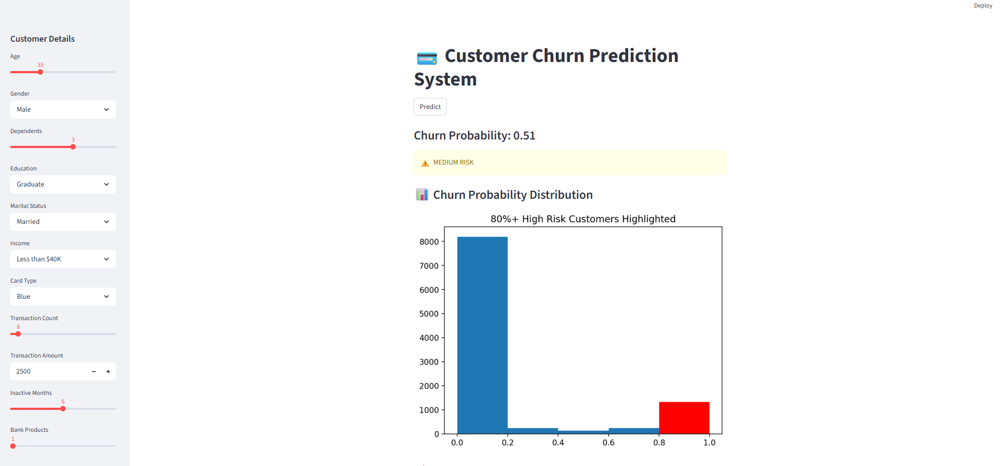
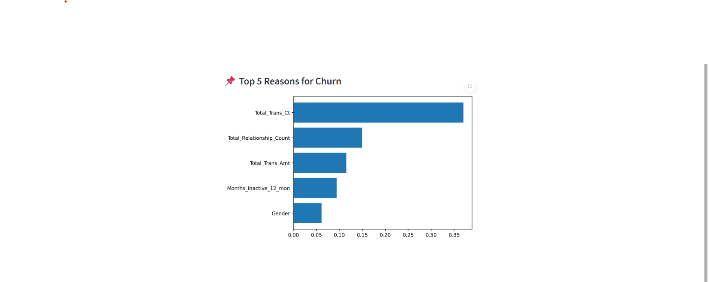

# 🏦 Customer Churn Prediction App

A machine learning application that predicts whether a bank customer is **likely to churn** or **not likely to churn** based on customer information.

This project uses the **BankChurners dataset** and an **XGBoost classification model** to predict customer churn. **SMOTE (Synthetic Minority Over-sampling Technique)** is used to handle class imbalance during model training.

The application provides an interactive **Streamlit web interface** where users can enter customer information, generate churn predictions, and view churn-related insights and visualizations.

---

## 📌 Project Overview

Customer churn is an important business problem for banks and financial institutions. Losing existing customers can negatively affect revenue, while identifying customers who are likely to leave can help businesses take preventive retention actions.

This project applies machine learning techniques to identify customers who are at risk of churning.

The system follows an end-to-end machine learning workflow:

```text
Customer Data
      ↓
Data Preprocessing
      ↓
Feature Preparation
      ↓
Train-Test Split
      ↓
SMOTE
      ↓
XGBoost Model
      ↓
Model Evaluation
      ↓
Model Saving
      ↓
Streamlit Application
      ↓
Customer Input
      ↓
Churn Prediction
      ↓
Insights & Visualization
```

---

## 🎯 Objectives

The main objectives of this project are:

* Predict whether a customer is likely to churn.
* Handle class imbalance using SMOTE.
* Build a classification model using XGBoost.
* Preprocess customer data for machine learning.
* Provide an interactive web-based prediction interface.
* Provide visual insights into customer churn.
* Support data-driven customer retention decisions.

---

## 🖥️ Application Screenshots

### 🏠 Customer Churn Prediction Dashboard

The Streamlit application provides an interactive interface where users can enter customer information and generate a churn prediction.



---

### 🔮 Churn Prediction Result

The application processes the customer's information using the trained XGBoost model and displays the predicted churn category.



---

## ✨ Key Features

* 🤖 Customer churn prediction using XGBoost
* ⚖️ Class imbalance handling using SMOTE
* 🧹 Data preprocessing
* 📊 Customer churn visualization
* 🔮 Real-time prediction through Streamlit
* 💾 Model storage using Joblib
* 📈 Machine learning model evaluation
* 🖥️ Interactive web application
* 💡 Churn-related customer insights

---

## 🛠️ Technologies Used

### 🐍 Programming Language

**Python**

Python is used for:

* Data processing
* Data preprocessing
* Machine learning
* Model training
* Prediction
* Application development

---

### 🤖 Machine Learning

#### XGBoost

**XGBoost (Extreme Gradient Boosting)** is used as the primary classification algorithm.

XGBoost is suitable for this project because it provides strong performance on structured/tabular datasets and is efficient for classification problems.

The model classifies customers into:

* **Likely to Churn**
* **Not Likely to Churn**

---

### ⚖️ SMOTE

**SMOTE (Synthetic Minority Over-sampling Technique)** is used to address class imbalance in the dataset.

Customer churn datasets generally contain more non-churned customers than churned customers. This imbalance can make it difficult for a machine learning model to properly learn the characteristics of churned customers.

SMOTE generates synthetic samples for the minority class during training to provide a more balanced training dataset.

---

## 📚 Libraries & Tools

| Technology           | Purpose                            |
| -------------------- | ---------------------------------- |
| **Python**           | Core programming language          |
| **Pandas**           | Data manipulation and analysis     |
| **NumPy**            | Numerical operations               |
| **Scikit-learn**     | Preprocessing and model evaluation |
| **XGBoost**          | Customer churn classification      |
| **Imbalanced-learn** | SMOTE implementation               |
| **Matplotlib**       | Data visualization                 |
| **Joblib**           | Saving and loading trained models  |
| **Streamlit**        | Interactive web application        |

---

## 📊 Dataset

This project uses the **BankChurners dataset** for customer churn prediction.

The dataset contains customer-related information from a banking environment. These attributes are used to identify patterns associated with customer attrition.

The dataset is stored at:

```text
data/BankChurners.csv
```

### Dataset Structure

```text
churn_prediction_app/
│
└── data/
    └── BankChurners.csv
```

---

## 🧹 Data Preprocessing

The raw customer data is processed before being provided to the machine learning model.

The preprocessing stage includes:

* Loading the dataset
* Removing unnecessary columns
* Handling categorical variables
* Encoding categorical features
* Preparing numerical features
* Separating features and target variable
* Splitting data into training and testing sets
* Handling class imbalance using SMOTE

The preprocessing logic is implemented in:

```text
src/data_preprocessing.py
```

---

## 🤖 Model Training

The project uses an **XGBoost Classifier** for customer churn prediction.

The model training process includes:

1. Loading the BankChurners dataset.
2. Preprocessing the customer data.
3. Separating input features and target variable.
4. Splitting the dataset into training and testing sets.
5. Applying SMOTE to the training data.
6. Training the XGBoost classification model.
7. Evaluating model performance.
8. Saving the trained model using Joblib.

The model training logic is implemented in:

```text
src/train_model.py
```

---

## 🔮 Prediction

The prediction module loads the trained model and uses customer information to generate a churn prediction.

The prediction logic is implemented in:

```text
src/predict.py
```

The model produces one of the following predictions:

```text
Likely to Churn
```

or

```text
Not Likely to Churn
```

---

## 🖥️ Streamlit Application

The frontend of the project is developed using **Streamlit**.

The application allows users to:

1. Enter customer information.
2. Submit the customer details.
3. Process the information through the trained machine learning model.
4. Generate a churn prediction.
5. View the prediction result.
6. View available churn-related insights and visualizations.

The Streamlit application is located at:

```text
app/app.py
```

---

## 💾 Model Storage

**Joblib** is used to save and load the trained machine learning model.

The trained model is stored inside:

```text
models/
```

This allows the application to load the trained model without retraining it every time the Streamlit application starts.

---

## 📁 Project Structure

```text
churn_prediction_app/
│
├── app/
│   └── app.py
│
├── data/
│   └── BankChurners.csv
│
├── models/
│   └── trained model files
│
├── src/
│   ├── data_preprocessing.py
│   ├── train_model.py
│   └── predict.py
│
├── images/
│   ├── dashboard.png
│   └── prediction.png
│
├── .gitignore
├── requirements.txt
└── README.md
```

---

## 📂 Folder & File Description

| File / Folder           | Description                                    |
| ----------------------- | ---------------------------------------------- |
| `app/`                  | Contains the Streamlit application             |
| `app.py`                | Main Streamlit application                     |
| `data/`                 | Contains the project dataset                   |
| `BankChurners.csv`      | Bank customer churn dataset                    |
| `models/`               | Stores trained machine learning models         |
| `src/`                  | Contains machine learning and prediction logic |
| `data_preprocessing.py` | Data cleaning and preprocessing                |
| `train_model.py`        | Model training and evaluation                  |
| `predict.py`            | Customer churn prediction                      |
| `images/`               | Contains application screenshots               |
| `dashboard.png`         | Application dashboard screenshot               |
| `prediction.png`        | Prediction result screenshot                   |
| `requirements.txt`      | Required Python dependencies                   |
| `.gitignore`            | Files excluded from Git                        |
| `README.md`             | Project documentation                          |

---

## ⚙️ Installation

### 1. Clone the Repository

```bash
git clone <your-github-repository-url>
```

Replace `<your-github-repository-url>` with your GitHub repository URL.

### 2. Navigate to the Project Directory

```bash
cd churn_prediction_app
```

### 3. Create a Virtual Environment

```bash
python -m venv .venv
```

### 4. Activate the Virtual Environment

#### Windows

```bash
.venv\Scripts\activate
```

#### macOS / Linux

```bash
source .venv/bin/activate
```

### 5. Install Dependencies

```bash
pip install -r requirements.txt
```

---

## 🚀 Running the Project

### Step 1: Train the Machine Learning Model

Run:

```bash
python src/train_model.py
```

This will:

* Load the dataset
* Preprocess the data
* Apply SMOTE
* Train the XGBoost model
* Evaluate the model
* Save the trained model

---

### Step 2: Run the Streamlit Application

Start the application using:

```bash
streamlit run app/app.py
```

The application will open in your default web browser.

---

## 📈 Machine Learning Workflow

### 1. Data Loading

The BankChurners dataset is loaded from the `data/` directory.

### 2. Data Preprocessing

The raw customer information is cleaned and transformed into a suitable format for machine learning.

### 3. Feature Preparation

Relevant customer attributes are prepared as input features.

### 4. Train-Test Split

The dataset is divided into training and testing sets to evaluate the model's performance on unseen data.

### 5. Class Balancing

SMOTE is applied to the training data to address the imbalance between churned and non-churned customers.

### 6. Model Training

The XGBoost classifier is trained using the processed and balanced training data.

### 7. Model Evaluation

The trained model is evaluated using classification metrics.

### 8. Model Saving

The trained model is saved using Joblib.

### 9. Prediction

The Streamlit application loads the saved model and generates churn predictions based on customer input.

---

## 💡 Business Value

Customer churn prediction can help banks and financial institutions:

* Identify customers who may leave.
* Prioritize high-risk customers.
* Develop targeted retention strategies.
* Improve customer engagement.
* Reduce potential customer loss.
* Make data-driven decisions.

For example, a bank can use churn predictions to identify customers who are more likely to leave and take appropriate retention actions.

---

## 🔮 Future Enhancements

The project can be further improved by adding:

* Churn probability scores
* Customer risk levels such as Low, Medium, and High
* Interactive dashboards
* Customer segmentation
* Personalized retention recommendations
* Comparison of multiple machine learning algorithms
* Hyperparameter optimization
* Automated model retraining
* Model performance monitoring
* Cloud deployment

---

## 📌 Important Notes

* The `.venv/` directory is excluded from Git.
* IDE-specific files such as `.idea/` should not be committed.
* Python cache files such as `__pycache__/` should be excluded.
* The `BankChurners.csv` dataset should be available in the `data/` directory before training.
* The trained model should be available in the `models/` directory before running predictions.

---

## 👩‍💻 Author

**Pratiksha Bolade**

This project was developed to demonstrate the practical application of machine learning for customer churn prediction using Python, XGBoost, SMOTE, and Streamlit.

---

## ⭐ Project Highlights

**Python • XGBoost • SMOTE • Scikit-learn • Streamlit • Pandas • NumPy • Matplotlib • Joblib**

An end-to-end machine learning application that transforms customer data into churn predictions and actionable business insights.
